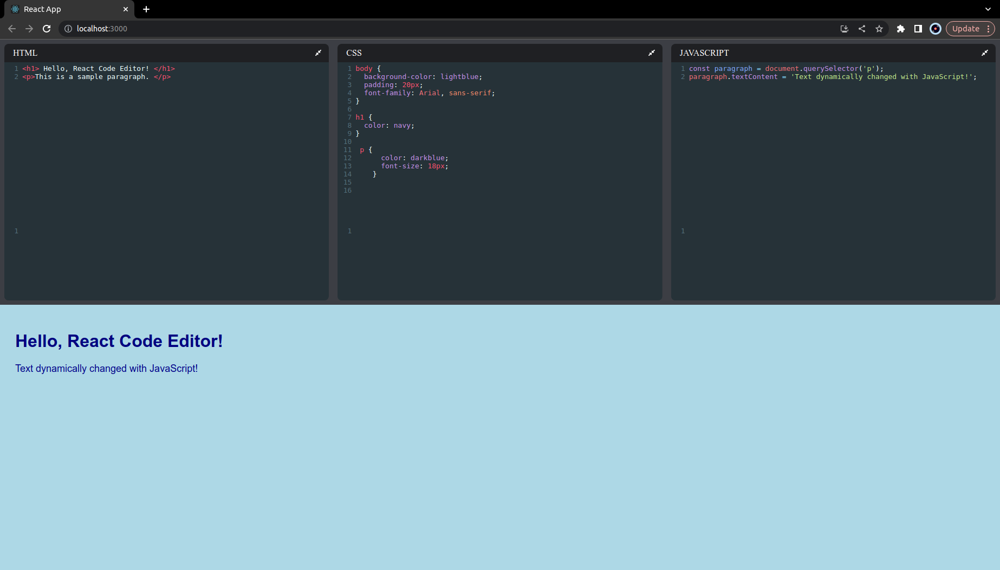

# Code Editor with Live Preview

This project is a code editor built using React that allows you to write and test code in HTML, CSS, and JavaScript languages. With a live preview feature, you can see the real-time output of your code as you make changes. This code editor is built with a focus on simplicity, usability, and efficient code execution.

## Features
- Support for HTML, CSS, and JavaScript languages.
- Real-time preview of the code output.
- Syntax highlighting for improved code readability.
- Code formatting for cleaner code structure.
- User-friendly interface for ease of use.

## Demo Output


## Getting Started
To run this code editor locally on your machine, make sure you have Node.js installed. If not, you can download it from [here](https://nodejs.org/).

1. Clone the repository:
   ```
   git clone https://github.com/mn1k/react-based-code-editor
   ```

2. Navigate to the project directory:
   ```
   cd react-based-code-editor
   ```

3. Install the dependencies:
   ```
   npm install
   ```

4. Start the development server:
   ```
   npm start
   ```

5. Open your browser and visit `http://localhost:3000` to access the code editor.

Explore and experiment with the code editor to write and test your HTML, CSS, and JavaScript code with live preview functionality.
